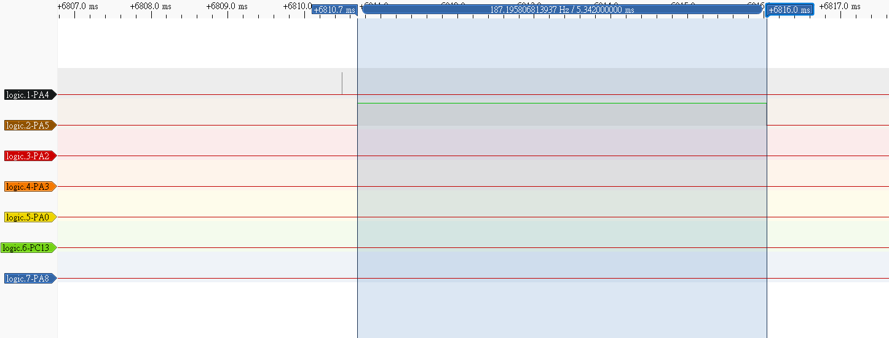

# 微處理機期末專題
##### 4112064230 電資二 王珈源
---
## 1. 下列請以GPIOB完成，七段顯示器型號為DC56-11EWA：
#### i. 將所有pin設定為output mode，並使pin 0~15輸出為0xAAAA。
---
Ans :
* 先透過 ```GPIOB->CRL``` 以及 ```GPIOB->CRH``` 設定 PB0~PB15。因為是輸出，所以都每個PB腳位都設定成 `0011`。
* 使用`GPIOB->ODR`輸出。

程式碼([question_1/q1_1/Src/main.c](question_1/q1_1/Src/main.c)) :
```c
#include <stm32f10x.h>

void GPIOB_Init_Output(void) {

    RCC->APB2ENR |= RCC_APB2ENR_IOPBEN;

    GPIOB->CRL = 0x33333333;  // PB0 ~ PB7 為輸出模式
    GPIOB->CRH = 0x33333333;  // PB8 ~ PB15 為輸出模式

    GPIOB->ODR = 0xAAAA;      // 0xAAAA = 1010101010101010
}

int main(void) {

    GPIOB_Init_Output();

    while (1) {
    }
}
```
結果截圖 : 
pcf 檔案 : [question_1/q1_1.pcf](question_1/q1_1.pcf)

#### ii. 根據圖一完成表一：(Low 為輸出低電壓 0，High 為輸出高電位 1)
---
Ans:


#### iii. 編寫程式使七段顯示器顯示 20。
---
Ans:
* 由第二小題表格結果找到2以及0對應的腳位輸出。

程式碼([question_1/q1_3/Src/main.c](question_1/q1_3/Src/main.c)) :
```c
#include <stm32f10x.h>

void GPIOB_Init_Output(void) {

    RCC->APB2ENR |= RCC_APB2ENR_IOPBEN;

    GPIOB->CRL = 0x33333333;  // PB0 ~ PB7 為輸出模式
    GPIOB->CRH = 0x33333333;  // PB8 ~ PB15 為輸出模式
}

int main(void) {

    GPIOB_Init_Output();

    const uint16_t SEG_CODE_2 = 0x5B; // 數字 '2' 的編碼 (g=1, f=0, e=1, d=1, c=0, b=1, a=1)
    const uint16_t SEG_CODE_0 = 0x3F; // 數字 '0' 的編碼 (g=0, f=1, e=1, d=1, c=1, b=1, a=1)
    uint16_t output_value = (SEG_CODE_0 << 7) | SEG_CODE_2;
    GPIOB->ODR = output_value;


    while (1) {
    }
}
```

結果截圖 : 


pcf 檔案 : [question_1/q1_3.pcf](question_1/q1_3.pcf)

## 2. 下列請以 GPIOA 完成，超音波模組型號為 HC-SR04：
#### i. Generate a pulse with a duration of 10us via PA0 using a for loop.
---
Ans :
程式碼([question_2/q2_1/Src/main.c](question_2/q2_1/Src/main.c)) : 
```c
#include <stm32f10x.h>

void GPIOA_Init_Trig() {
    RCC->APB2ENR |= (1 << 4);  // 開啟 GPIOA 時鐘

    // PA0 PA1
    GPIOA->CRL |=  0x00000043;
}

void delay_us(int us) {
	int temp = us * 9;
	for(int i = temp;i>=0;i--);
}

void send_ultrasonic_trig(int us) {
    // 拉高 PA0
    GPIOA->ODR |= (1 << 0);
    delay_us(us);
    // 拉低 PA0
    GPIOA->ODR &= ~(1 << 0);
}

int main(void) {

    GPIOA_Init_Trig();

    while (1) {
    	send_ultrasonic_trig(10);
    	for (int i = 0; i < 100000; i++);
    }
}
```
結果截圖 : 

pcf 檔案 : [question_2/q2.pcf](question_2/q2.pcf)

#### ii. 編寫程式讀取超音波模組數據。
---
Ans :
* 根據查到的結果，超音波模組的使用方式為在 Trig 端送出 10微秒 的方波，告知模組啟動。結果會於 Echo 端呈現。
* 這邊將 PA0 設為 Trig 端，PA1設定為 Echo 端。
 
程式碼([question_2/q2_2/Src/main.c](question_2/q2_2/Src/main.c)) :
```c
#include <stm32f10x.h>

void GPIOA_Init_Trig() {
    RCC->APB2ENR |= (1 << 4);  // 開啟 GPIOA 時鐘

    // PA0 PA1
    GPIOA->CRL |=  0x00000043;
}

void delay_us(int us) {
	int temp = us * 9;
	for(int i = temp;i>=0;i--);
}

void delay_ms(int us) {
	int temp = us * 9000;
	for(int i = temp;i>=0;i--);
}

void send_ultrasonic_trig(int us) {
    // 拉高 PA0
    GPIOA->ODR |= (1 << 0);
    delay_us(us);
    // 拉低 PA0
    GPIOA->ODR &= ~(1 << 0);
}

int main(void) {

    GPIOA_Init_Trig();

    while (1) {
    	send_ultrasonic_trig(10);
    	delay_ms(1000);
    }
}
```
結果截圖 : 

pcf 檔案 : [question_2/q2.pcf](question_2/q2.pcf)


## 3. 下列請以 TIM2 (PWM) 完成，伺服馬達型號為 SG90：
#### i. Generate a square wave with a period 20ms.
#### ii. 編寫程式使伺服馬達順時針與逆時針旋轉。
----
Ans :
* 第一部分要產生週期為20ms的波，而 (72)(20000)/72M 就會等於 20ms， 所以將 PSC 設定為 (72 - 1)，ARR 設定為 (20000 - 1)
* 第二部分要控制伺服馬達(SG90)。控制方式為固定發出 20ms 週期的波，而不同的 Duty Cycle 會導致馬達的轉向不同。
  * 1 ms : 0 degree
  * 1.5 ms : 90 degree
  * 2 ms : 180 degree
* 根據以上，只要調整 PWN 的 CCR1 數值，就可以產生順逆轉向。

兩部分程式碼([question_3/q3/Src/main.c](question_3/q3/Src/main.c)) : 
```c
#include <stm32f10x.h>

// 3.1 Generate a square wave with a period 20ms.
void generate_wave() {
    RCC->APB2ENR = 0xFC; // 開啟 GPIO 腳位
    RCC->APB1ENR = (1<<0); // enable TIM2
    GPIOA->CRL |= 0xB; // PA0 設定
    TIM2->CCER = 0x1;
    TIM2->CCMR1 |= 0x60; // PWN 1
    TIM2->PSC = 72 - 1;
    TIM2->ARR = 20000 - 1;
    TIM2->CCR1 = 500;
    TIM2->CR1 = 1;
}

// 3.2
void Servo_SetAngle(uint8_t angle) {
    uint16_t pulse;
    if(angle == 0) {
        pulse = 1000;
    } else if (angle == 90) {
        pulse = 1500;
    } else {
        pulse = 2000;
    }
    TIM2->CCR1 = pulse;
}

void delay_ms(int us) {
	int temp = us * 9000;
	for(int i = temp;i>=0;i--);
}

int main(void) {

    generate_wave();

    while (1) {

    	// 3.2
    	Servo_SetAngle(0);    // 最左，順時針
        delay_ms(10000);  // 延遲等待伺服轉動

        Servo_SetAngle(180);  // 最右，逆時針
        delay_ms(10000);  // 延遲等待

        Servo_SetAngle(90);   // 回中間
        delay_ms(10000);
    }
}
```
結果截圖 :


pcf檔案 : [question_3/q3.pcf](question_3/q3.pcf)

## 4. 下列請以 USART1 (baud rate 為 9600) 完成，藍芽模組型號為 HC-06：
#### i. Send a character ('A') to the IO Virtual Term.
---
Ans :

程式碼([question_4/q4_1/Src/main.c](question_4/q4_1/Src/main.c)) :
```c
#include <stm32f10x.h>

// 4.1
void USART1_Init(void) {
    RCC->APB2ENR |= RCC_APB2ENR_IOPAEN | RCC_APB2ENR_USART1EN;

    GPIOA->CRH |=  0x000004A0;

    USART1->BRR = 0x1D4C;  // 設定 9600 bps（72MHz 時）
    USART1->CR1 |= USART_CR1_TE;   // 啟用傳送器
    USART1->CR1 |= USART_CR1_UE;   // 啟用 USART
}

// 傳送一個字元
void USART1_SendChar(char c) {
    while (!(USART1->SR & USART_SR_TXE));  // 等待 TX 空
    USART1->DR = c;
}

int main(void) {

    USART1_Init();

    while (1) {
    	//4.1
        USART1_SendChar('A');  // 傳送字元 A
        USART1_SendChar('\r');
        USART1_SendChar('\n');
        for (int i = 0; i < 1000000; i++);  // 簡單延遲
    }
}
```

結果截圖 :


pcf 檔案 : [question_4/q4.pcf](question_4/q4.pcf)

#### ii. 編寫程式使藍芽 (USART1) 每秒發送一個數字給 IO Virtual Term，數字依序為 0 至 20。
---
Ans :

程式碼([question_4/q4_2/Src/main.c](question_4/q4_2/Src/main.c)) :
```c
#include <stm32f10x.h>

void USART1_Init(void) {
    RCC->APB2ENR |= (1<<14) | (1<<2);

    GPIOA->CRH |=  0x000004A0;

    USART1->BRR = 7500;  // 設定 9600 bps（72MHz 時）
    USART1->CR1 = 0x200C;   // 啟用傳送器
}

// 傳送一個字元
void USART1_SendChar(char c) {
    while (!(USART1->SR & USART_SR_TXE));  // 等待 TX 空
    USART1->DR = c;
}

void delay_ms(int us) {
	int temp = us * 9000;
	for(int i = temp;i>=0;i--);
}

int main(void) {

    USART1_Init();

    while (1) {
    	//4.2
    	for(int i=0;i<=20;i++){
    		if(i<10) {
				USART1_SendChar(i + '0');
				USART1_SendChar('\r');
				USART1_SendChar('\n');
				delay_ms(1000);
    		} else {
    			USART1_SendChar(i/10 + '0');
    			USART1_SendChar(i%10 + '0');
				USART1_SendChar('\r');
				USART1_SendChar('\n');
				delay_ms(1000);
    		}
    	}
    }
}
```

結果截圖 :


pcf 檔案 : [question_4/q4.pcf](question_4/q4.pcf)

## 5. 下列請以 Interrupt 與 Timer 完成系統整合實現停車場系統（有關時間的都要用 Timer 或 SysTick 實現）：

完整專案程式碼 : [question_5/q5/Src/main.c](question_5/q5/Src/main.c)

pcf 檔案 : [question_5/q5.pcf](question_5/q5.pcf)

影片連結 : https://youtu.be/Cuuo0i9GmN8

### i. 超音波感測（建議使用 Timer2）
程式碼邏輯 :

1. 利用 Systick 產生 10 微秒的中斷，並利用計數(`tick_ms`)的方式產 delay 。
2. 超音波感測則利用GPIO的中斷。當Echo端有訊號時，使用EXIT紀錄當下的 `tick_ms`，然後在訊號中斷時再紀錄一次，減掉之前的就可以得到Echo的時長。
3. 利用 `choose_flag` 作為要送出哪個超音波 Trig 的flag，0是入口，1是出口。
4. 在發出 Trig 時紀錄當下的`tick_ms`，然後在結束時對照是否有delay 2.5s，如果沒有則delay到 2.5s。

#### A. 入口每 5 秒產生一個 trig 檢測是否有車子要進來。
---
Ans :
* 使用 PA4 作為入口超音波的 Trig ，PA5 為入口超音波的 Echo。

結果截圖 : 


#### B. 出口先延遲2.5秒再每5秒產生一個trig是否有車子要出去。每五秒 trig。入口跟出口 trig 時間相差2.5秒。
---
Ans :
* 使用 PA2 作為出口超音波的 Trig ，PA3 為出口超音波的 Echo。

先延遲 2.5 s (跟入口差2.5s):


每5秒產生一個trig :


#### C. 使用中斷捕捉 Echo 上升時間和下降時間，然後透過下面公式轉換成公尺。
---
Ans :

將入口設為 92 cm


查看波型結果


$$(0.005342 * 343 / 2 * 100) = 91.6$$
與預設吻合

### ii.	伺服馬達閘門
#### A. 當出入口的Echo 讀到的值小於 100m，相對應的閘門要打開讓車子進出，然後關閉閘門(伺服馬達打開和關閉閘門90度轉動)。
---
Ans :

入口控制 :


出口控制 :


#### B. 車輛進入時剩餘車位減1，車輛出去時剩餘車位加1，並將剩餘車位數顯示於2-digit七段顯示器(車位數初始值20)。
---
Ans :

初始值照片 :


七段顯示器顯示當前剩餘車格數 :


#### C. 當車位停滿時，七段顯示器顯示00並以一秒為週期進行閃爍(連續重複亮0.5 sec與暗0.5 sec)。此時，閘門維持不動。
---
Ans :

閘門維持不動，一秒週期閃爍 :


#### D. 透過藍芽(USART1)傳送目前車輛數目給 IO Virtual Term (轉成兩個數字的ASCII Code後傳送)。
---
Ans :

IO 顯示當前車輛數目 :
